

	

<h3 align="center">Terrainy</h3>

  

   Quickly create natural-looking terrain with customizable noise parameters. This tool is designed to create simple terrains that do not require manual painting
	 
	·
	<a href="https://github.com/ninetailsrabbit/terrainy/issues/new?assignees=ninetailsrabbit&labels=%F0%9F%90%9B+bug&projects=&template=bug_report.md&title=">Report Bug</a>
	·
	<a href="https://github.com/ninetailsrabbit/terrainy/issues/new?assignees=ninetailsrabbit&labels=%E2%AD%90+feature&projects=&template=feature_request.md&title=">Request Features</a>
  

 
 

- [📦 Installation](#-installation)
- [Getting started 📝](#getting-started-)
  - [Terrain parameters 🗻](#terrain-parameters-)
    - [Mesh resolution](#mesh-resolution)
    - [Size depth](#size-depth)
    - [Size width](#size-width)
    - [Max terrain height](#max-terrain-height)
    - [Terrain meshes](#terrain-meshes)
    - [Terrain Material](#terrain-material)
  - [Noise parameters](#noise-parameters)
    - [Randomize noise seed](#randomize-noise-seed)
    - [Noise](#noise)
    - [Noise texture](#noise-texture)
    - [Elevation curve](#elevation-curve)
    - [Fallof map texture](#fallof-map-texture)
      - [Smooth edges](#smooth-edges)
      - [Abstract Curve](#abstract-curve)
      - [Black Holes](#black-holes)
      - [Center Line](#center-line)
      - [Center Soft](#center-soft)
      - [Circle](#circle)
      - [Inverted Circle](#inverted-circle)
      - [Tiny Circle](#tiny-circle)
      - [Circle Irregular](#circle-irregular)
      - [Vertical](#vertical)
- [Shader materials 🏞️](#shader-materials-️)
  - [Albedo terrain mix](#albedo-terrain-mix)

# 📦 Installation

1. [Download Latest Release](https://github.com/ninetailsrabbit/terrainy/releases/latest)
2. Unpack the `addons/ninetailsrabbit.terrainy` folder into your `/addons` folder within the Godot project
3. Enable this addon within the Godot settings: `Project > Project Settings > Plugins`

To better understand what branch to choose from for which Godot version, please refer to this table:
|Godot Version|terrainy Branch|terrainy Version|
|---|---|--|
||`4.3`|`1.x`|
||`main`|`1.x`|

---

# Getting started 📝

Creating a new terrain is as easy as adding the `Terrainy` node into your scene.

This node will warn you in the editor that it needs:

- A `terrain meshes` array representing a group of `MeshInstance3D` from which you want to generate the terrains.
- A `noise` value with an instance of `FastNoiseLite` which is used as a template for generating the terrain surface or a custom `noise_texture`.

**_If you try to generate a terrain without this values a warning will be pushed to the output window but it does not interrupt the execution of your game._**

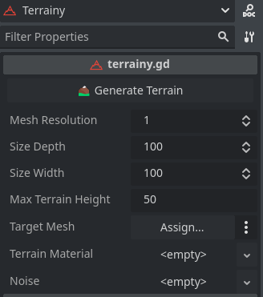

---

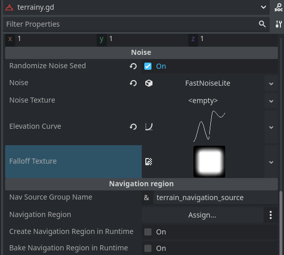

## Terrain parameters 🗻

This section contains information on parameters that affects the terrain generation. Each time one of this is change in the editor, a new terrain is generated.

### Mesh resolution

More resolution means more detail _(more dense vertex)_ in the terrain generation, this increases the mesh subdivisions and could reduce the performance in low-spec pcs.

### Size depth

The depth size of the mesh (z) in godot units (meters)

### Size width

The width size of the mesh (x) in godot units (meters)

### Max terrain height

The maximum height (y) at which this terrain can be generated in godot units (meters). The noises values are in a range of _(0, 1)_. So if the noise value in a specific vertex point it's `0.5` the height returned for a `max_terrain_height` of 50 the result will be `50 * 0.5 = 25`

### Terrain meshes

The terrain meshes `Array[MeshInstance3D]` where the terrain meshes will be generated. On each mesh a new `PlaneMesh` is generated be careful if you have a mesh already created

**The final mesh will always end up as a result in an `ArrayMesh`.**

### Terrain Material

This is the material that will be applied to the Terrain. Take a look on [Shader material](#shader-material) examples to get a detailed terrain surface mixing textures.

## Noise parameters

### Randomize noise seed

When enabled, in each generation the seed of the selected noise will be randomized. Disable it to do it manually and keep the same seed for the generated land and not lose the structure.

### Noise

This is a [FastNoiseLite](https://docs.godotengine.org/en/stable/classes/class_fastnoiselite.html#fastnoiselite) instance. Noise values are perfect to generate a variety of surfaces, higher frequencies tend to generate more mountainous terrain.

Play with the parameters and different types of noise to get the result you want, take into account that if this `noise` variable is defined, the `noise_texture` will be ignored.

### Noise texture

Use a texture as noise to generate the terrain. **If a `noise` is defined, this texture will be ignored.**

You can find a lot of ready noise textures inside the addon in this path `addons/ninetailsrabbit.terrainy/assets/SBS - Noise Texture Pack - 256x256` folder from [ScreamingBrainStudios](https://screamingbrai.nstudios.itch.io/noise-texture-pack)

This textures are divided into categories:

- Cracks
- Craters
- Gabor
- Grainy
- Manifold
- Marble
- Melt
- Milky
- Perlin
- Spokes
- Streak
- Super Noise
- Super Perlin
- Swirl
- Techno
- Turbulence
- Vein
- Voronoi

### Elevation curve

This curve is powerful that you can adjust what the maximum height on the ground will be according to the graph from left to right in the generated noise image. This allows you to create flat mountains or holes in the generated terrain

Here you can see an example:

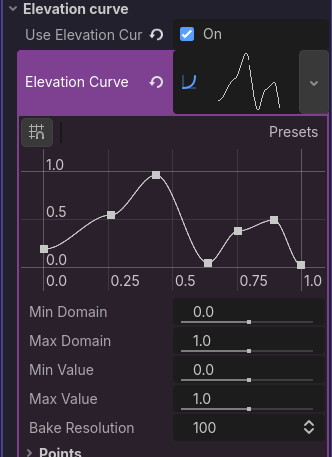

### Fallof map texture

Use an image to smooth the edges on the terrain. We provide a few images to get some extra shapes in the generated terrains by being able to create islands, cliffs and so on.

Below I will show the images and the result of the generated plots.

---

#### Smooth edges

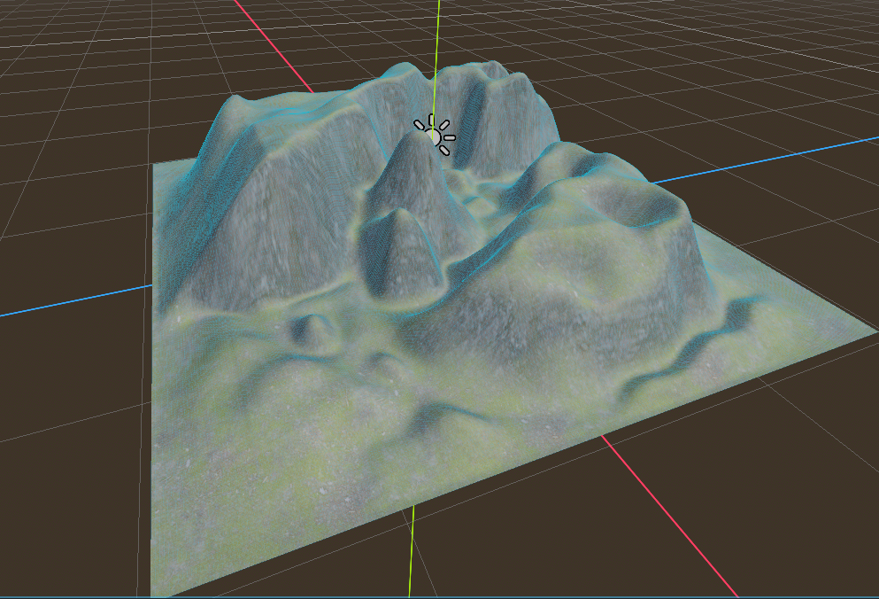

#### Abstract Curve

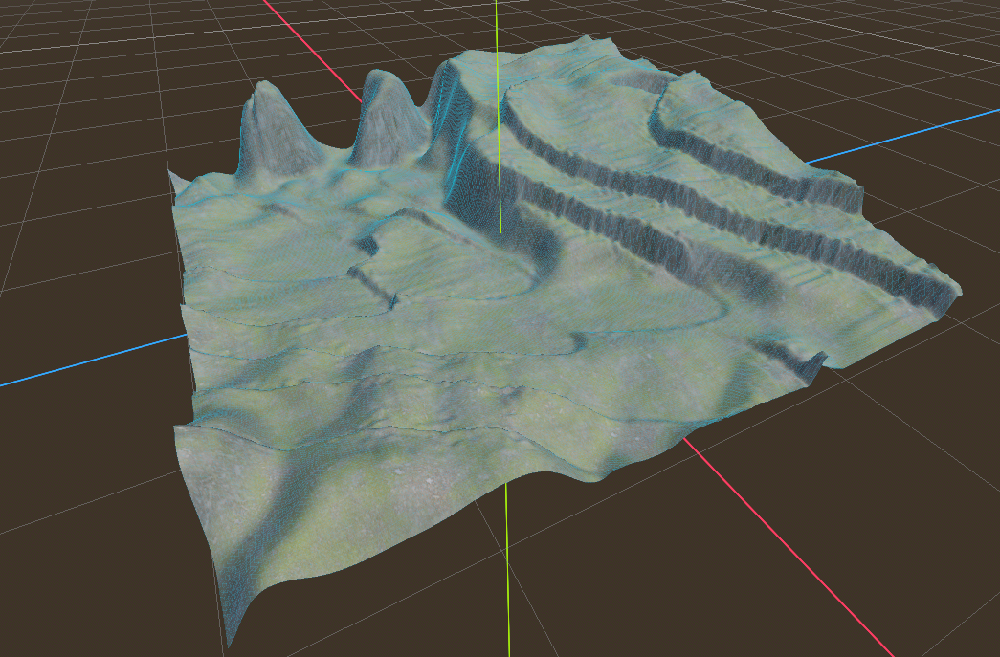

#### Black Holes

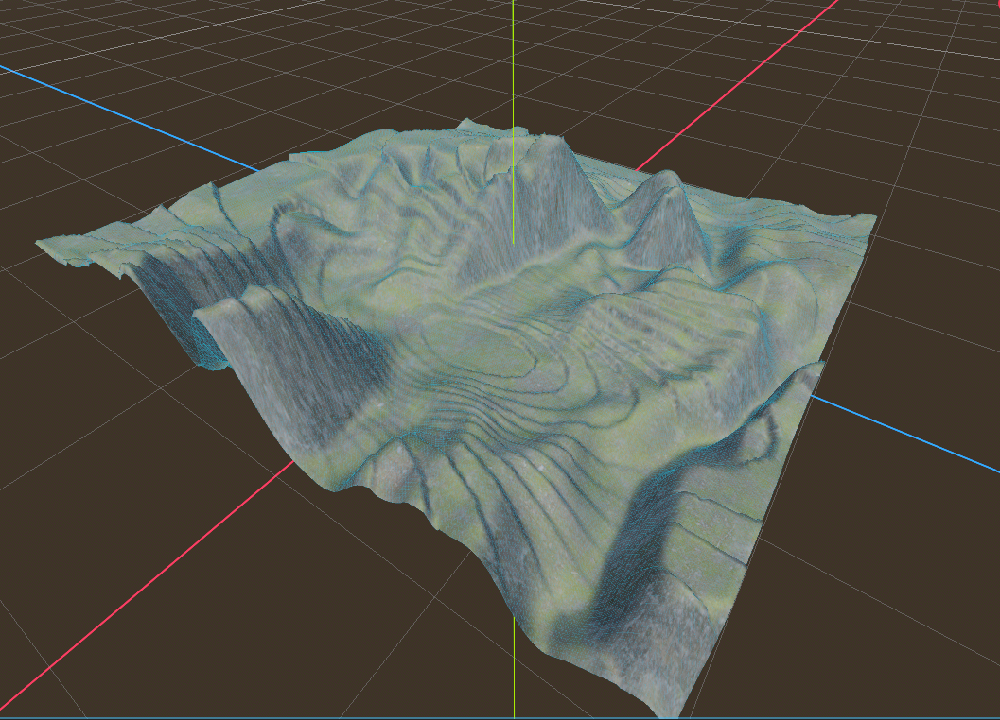

#### Center Line

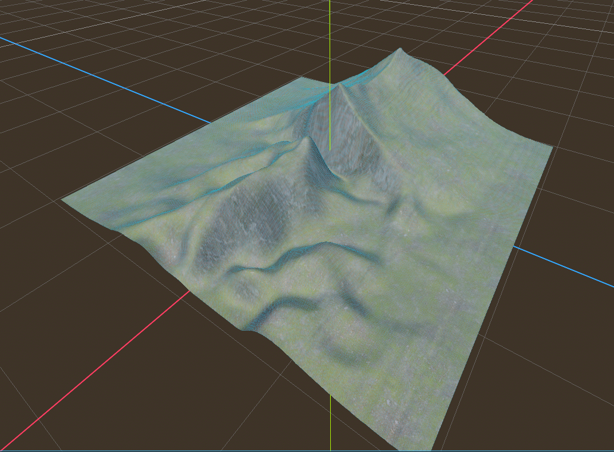

#### Center Soft

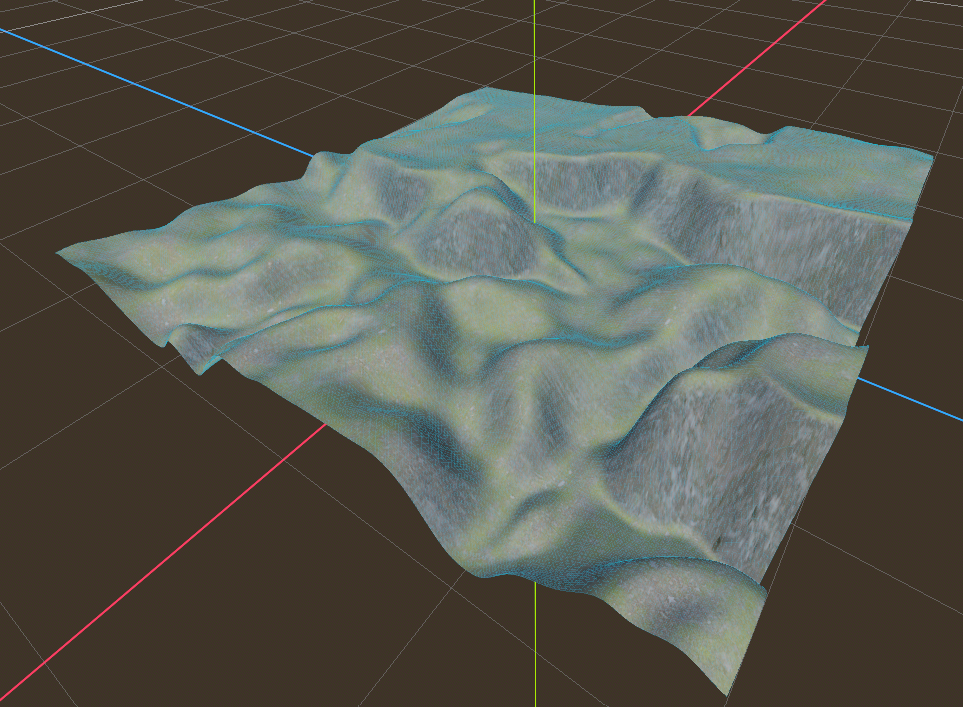

#### Circle

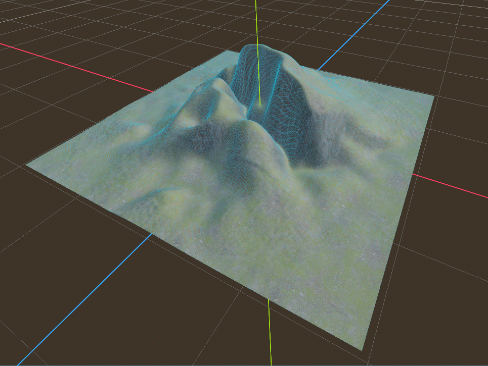

#### Inverted Circle

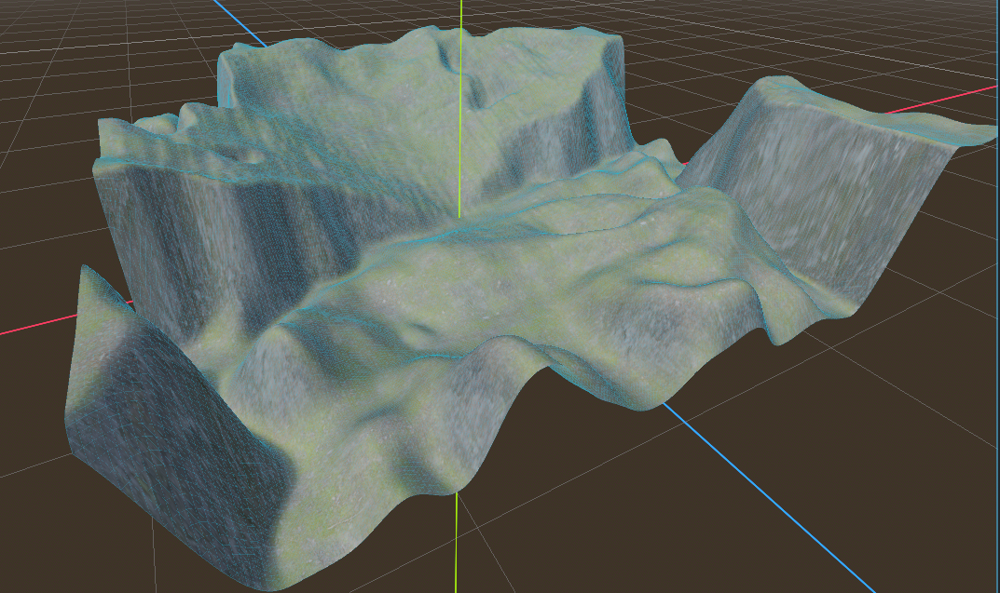

#### Tiny Circle

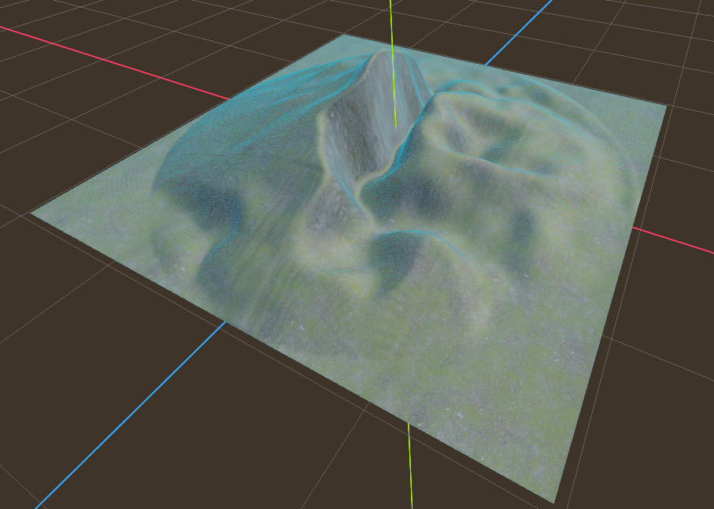

#### Circle Irregular

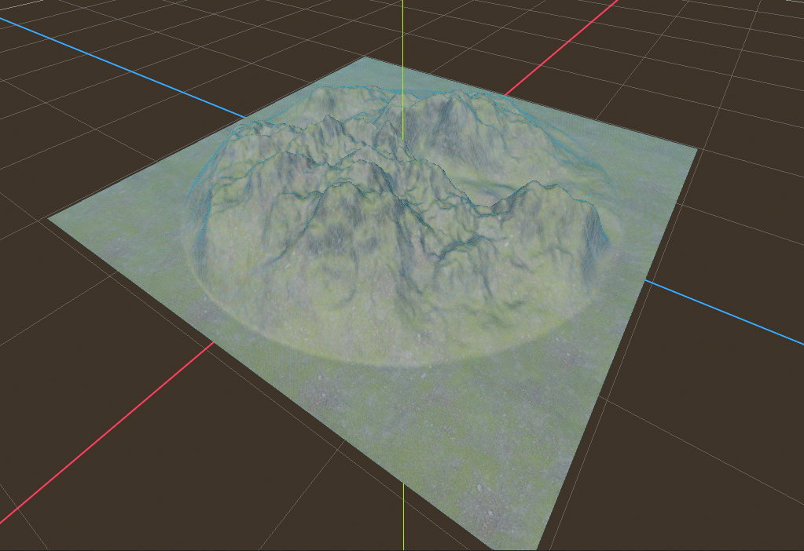

#### Vertical

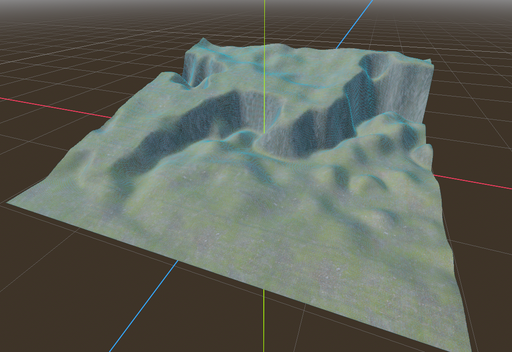

# Shader materials 🏞️

When you generate the terrain with a `StandardMaterial3D` the result will be simple and with a single colour unless you use gradients.

This can be useful for some cases where you don't need a lot of detail but if you need something more advanced there are some shaders that can help us.

## Albedo terrain mix

This addons comes with a modified shader from [DiztyNinja](https://www.youtube.com/@ditzyninja) that can be used on `terrain_material` exported parameter.

With this shader you can mix a total of 3 textures that represents a surface based on the height of the terrain where grass represents the `top surface`, the rock represents the `medium surface` and the sand represents the `bottom_surface`.

Play around with the parameters until you get the result you want.

You can see an example here using textures from [https://ambientcg.com/](https://ambientcg.com/)

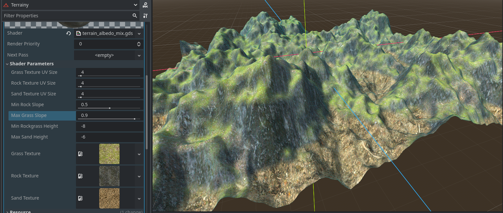
